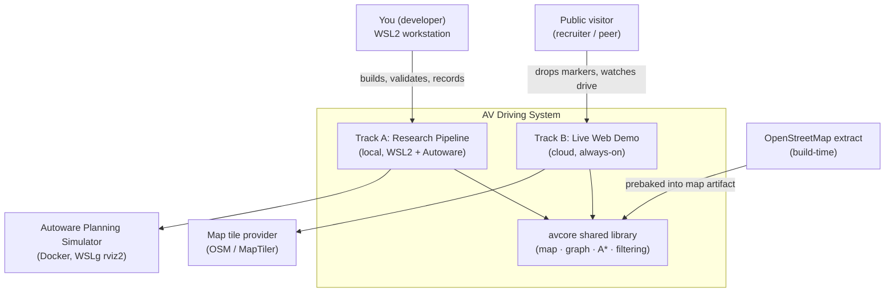
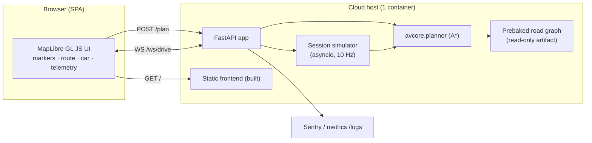
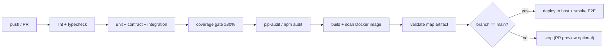

# Autonomous Vehicle Driving System — Enterprise Architecture

**Status:** Draft for approval · **Version:** 0.1 · **Owner:** Chinmay Singh · **Date:** 2026-07-05
**Companion doc:** [SPEC.md](SPEC.md) (feasibility + scope). This document defines *how* the system is built to an enterprise, replicable standard.

---

## 0. How to read this document

Sections 1–3 set vision, principles, and the system model. Sections 4–8 define the components and their contracts. Sections 9–15 cover the enterprise concerns that make this "production-grade" rather than a script collection: quality, security, observability, delivery, cost, governance, risk. Section 16 is the phased plan with acceptance criteria. Section 17 is the set of decisions I need you to confirm before implementation.

---

## 1. Vision & success criteria

**Vision.** A single, coherent autonomous-driving codebase that (a) faithfully replicates the original research pipeline — lane detection → Lanelet2 map → route filtering → route planning → validated in Autoware — and (b) exposes that same planning intelligence through a public, always-on web demo where anyone drops start/destination markers and watches a simulated vehicle plan and drive the route to arrival.

**What "done" means (measurable):**

| # | Success criterion | Target |
|---|---|---|
| S1 | Lane detection runs on sample clips | ≥ 20 FPS CPU (classical), detection rate reported vs. ground truth |
| S2 | Generated Lanelet2 map loads & routes in Autoware Planning Simulator | 5/5 scenarios route successfully |
| S3 | Own A\* planner matches Autoware's route on shared map | ≥ 90% lanelet-sequence agreement, differences explained by cost model |
| S4 | Public demo reachable, plan+drive works end to end | p95 `/plan` < 300 ms; drive telemetry at 10 Hz |
| S5 | Anyone can reproduce locally from README | Cold clone → local demo in < 30 min, one command |
| S6 | Engineering quality gates green | Lint + type + tests + coverage ≥ 80% on shared core |

**Non-goals (explicit).** Real vehicle actuation; full sensor-fusion stack; multi-agent traffic; production SLA/on-call; per-visitor Autoware instances (infeasible/uneconomic — see [SPEC.md](SPEC.md) §1).

---

## 2. Architectural principles

1. **One brain, two bodies.** The planning/filtering/map logic lives in a single versioned library (`avcore`) imported by both the Autoware track and the web track. The demo literally runs the validated algorithm — no reimplementation drift.
2. **Contracts before code.** Every boundary (REST, WebSocket, map format, module API) has an explicit, versioned schema. Components are replaceable behind their contract.
3. **Deterministic & reproducible.** Pinned dependencies, pinned Docker digests, seeded simulation, fixed map artifacts. Same inputs → same outputs, on any machine.
4. **12-factor config.** No secrets or environment assumptions in code; all config via environment/pydantic-settings.
5. **Fail safe, degrade gracefully.** Invalid input rejected at the edge; unreachable goals return a typed error, never a crash; the simulator bounds every session.
6. **Test the intelligence, not just the plumbing.** Autoware is the golden reference for the planner; the planner has property-based and scenario tests independent of the web layer.
7. **Portfolio-legible.** Architecture, decisions (ADRs), diagrams, and results are first-class artifacts in the repo, written for a reviewer skimming in 5 minutes.

---

## 3. System model (C4)

### 3.1 Context



### 3.2 Containers (Track B runtime)



### 3.3 Component boundaries & ownership

| Component | Package | Responsibility | Consumed by |
|---|---|---|---|
| Map model | `avcore.map` | Load/validate Lanelet2 OSM → typed in-memory graph | everything |
| Routing graph | `avcore.graph` | Build directed graph (successor/adjacent edges + costs) | planner, filtering |
| Filtering | `avcore.filtering` | Geometric + attribute + connectivity pruning; post-plan route ranking | planner, Autoware prep |
| Planner | `avcore.planner` | A\* / Dijkstra over graph → lanelet sequence + centerline | web, research eval |
| Lane detection | `avlane` (separate pkg) | Video/image → lane polylines (JSON) | conversion track |
| Conversion | `avmap_tools` | polylines→Lanelet2, OSM→Lanelet2, validators | map artifacts |
| Web backend | `webdemo.backend` | REST + WS, session lifecycle, sim orchestration | frontend |
| Simulator | `webdemo.backend.sim` | Kinematic bicycle + pure-pursuit controller | web backend |
| Frontend | `webdemo.frontend` | Rendering + interaction only (no logic) | visitor |

**Key rule:** `avcore` has **zero** dependency on web, Autoware, or OpenCV. It is pure Python + numpy + a graph lib. This is what makes it testable, reusable, and honest.

---

## 4. Data & map architecture (the single source of truth)

**Canonical format:** Lanelet2 OSM XML (`.osm`) + `map_projector_info.yaml`. This is Autoware-native, so the *same file* validates in Autoware and feeds the web demo. No format divergence.

**Map lifecycle:**
```
OSM extract (OSMnx)  ──►  avmap_tools/osm_to_lanelet  ──►  lanelet2_map.osm
lane polylines JSON  ──►  avmap_tools/polyline_to_lanelet ──►  lanelet2_map.osm
                                   │
                                   ▼  build step (Makefile target)
                         avcore.map.load() + validate()
                                   │
              ┌────────────────────┴───────────────────┐
              ▼                                         ▼
   Autoware map_path (Track A)              prebaked graph.pkl (Track B artifact)
```

**Map schema versioning.** The map artifact carries a `schema_version` tag; `avcore.map.load()` refuses mismatched majors. Prebaked graphs are content-hashed so the web build is reproducible and cache-busted.

**Validation gate (runs in CI and before Autoware).** `avmap_tools validate <map>` asserts: connected largest SCC, monotonic node ordering, lanelet width ∈ [2.5, 6.0] m, no self-intersecting bounds, every lanelet has ≥1 successor or is a terminal, projector origin present. A map that fails validation never reaches Autoware or deploy.

---

## 5. Interface contracts (the boundaries)

### 5.1 REST — `POST /plan`
```jsonc
// Request
{ "start": {"lat": 43.7384, "lng": 7.4246},
  "goal":  {"lat": 43.7402, "lng": 7.4290},
  "cost":  "travel_time" }        // enum: distance | travel_time
// 200 Response
{ "route_id": "r_9f2a...",
  "lanelet_ids": [101, 104, 137, ...],
  "geometry": { "type": "LineString", "coordinates": [[lng,lat],...] },
  "distance_m": 812.4, "eta_s": 96.3, "lane_changes": 1 }
// 422 Response (typed errors, never a stack trace)
{ "error": "UNREACHABLE_GOAL", "detail": "No route between snapped lanelets 101→560" }
// error codes: OUT_OF_COVERAGE | UNREACHABLE_GOAL | INVALID_INPUT | SNAP_FAILED
```

### 5.2 WebSocket — `GET /ws/drive?route_id=...`
```jsonc
// Server → client, ~10 Hz
{ "t": 12.3, "lat": 43.739, "lng": 7.426, "heading_deg": 78.4,
  "speed_mps": 8.1, "cte_m": 0.12, "progress": 0.34, "state": "driving" }
// terminal frame
{ "state": "arrived" | "aborted", "reason": "..." }
// Client → server
{ "cmd": "start" | "pause" | "resume" | "cancel" }
```
Contract rules: server is authoritative; session has a hard TTL (e.g. 180 s) and a max concurrent-session cap; on disconnect the sim task is cancelled and resources freed.

### 5.3 Module API — `avcore.planner`
```python
def plan_route(graph: RoutingGraph, start: LaneletId, goal: LaneletId,
               cost: CostModel = TravelTime(), *, seed: int | None = None
              ) -> RouteResult:  # deterministic given inputs
    """A* over lanelet graph. Raises UnreachableGoal / SameNode handled by caller."""
```

These three contracts are frozen early and versioned. Everything else can change behind them.

---

## 6. The vehicle simulation & control (Track B core loop)

- **Model:** kinematic bicycle, state `(x, y, θ, v)`, wheelbase `L`, `dt = 0.1 s`. Deterministic given seed.
- **Controller:** pure pursuit with adaptive lookahead `Ld = clamp(k·v, Ld_min, Ld_max)`; steering `δ = atan2(2 L sinα, Ld)`.
- **Speed profile:** target speed = min(lanelet speed limit, curvature-limited speed `√(a_lat_max / κ)`); trapezoidal accel/decel toward goal; hard stop at arrival radius (3 m).
- **Termination:** arrival, TTL exceeded, cross-track error > threshold (flag as controller failure — good telemetry), or client `cancel`.
- **Concurrency:** one asyncio task per session; global semaphore caps simultaneous drives; backpressure returns `503` with retry hint when saturated. A bicycle model at 10 Hz is ~microseconds/step, so the cap protects memory/sockets, not CPU.

---

## 7. Track A — research pipeline architecture

Same stages as [SPEC.md](SPEC.md) §3, now with enterprise wrapping:
- Each stage is a CLI with typed args (Typer), reads/writes versioned artifacts, and is independently testable.
- Lane detection ships classical (baseline, always runs) + optional UFLD-ONNX (documented comparison), behind a common `LaneDetector` interface.
- Autoware runs from a **pinned image digest** via `docker-compose`; the map + projector are mounted read-only. Evaluation is scripted (launch → set poses via ROS 2 service calls where possible → record rosbag → extract metrics) so results are reproducible, not hand-clicked.
- Golden-reference testing: Autoware's mission-planner route is captured and diffed against `avcore.planner` output in an integration test tagged `@autoware` (opt-in, not in the fast CI lane).

---

## 8. Repository & module structure (monorepo)

```
autonomous-driving/
├── packages/
│   ├── avcore/            # pure logic: map, graph, filtering, planner  (100% unit-tested)
│   │   ├── src/avcore/{map,graph,filtering,planner,models}.py
│   │   └── tests/
│   ├── avlane/            # lane detection (OpenCV / ONNX)
│   └── avmap_tools/       # converters + validators (CLI)
├── apps/
│   ├── webdemo/
│   │   ├── backend/       # FastAPI, sim, controller  (imports avcore)
│   │   └── frontend/      # Vite + TS + MapLibre
│   └── autoware_eval/     # docker-compose, launch scripts, EVAL.md
├── artifacts/             # versioned maps, prebaked graphs, sample clips (via Git LFS/DVC)
├── docs/
│   ├── ARCHITECTURE.md    # this file
│   ├── adr/               # Architecture Decision Records (0001-*.md)
│   └── diagrams/
├── infra/                 # fly.toml / Dockerfiles / compose / CI
├── .github/workflows/     # ci.yml, deploy.yml, security.yml
├── Makefile               # one-command targets (setup, test, map, run, deploy)
├── pyproject.toml         # workspace, tool config (ruff, mypy, pytest)
└── README.md
```
Tooling: **uv** or **Poetry** workspace for the Python packages; **pnpm** for the frontend; **Make** as the human-facing entrypoint (`make setup`, `make test`, `make demo`, `make map`, `make autoware`).

---

## 9. Quality engineering & testing strategy

**Testing pyramid:**
- **Unit (fast, every push):** `avcore` at ≥ 80% coverage — graph construction, A\* correctness (known-optimal graphs), filtering rules, cost models. Property-based tests (Hypothesis): planner never returns a route with a disconnected edge; route cost is monotonic under edge-weight increase.
- **Contract tests:** schema validation for `/plan` and WS frames (pydantic models double as the contract); frontend consumes a mocked backend.
- **Integration:** backend TestClient drives `/plan` + a full simulated drive to arrival on a fixture map; asserts arrival and bounded CTE.
- **Simulation/golden (opt-in `@autoware`):** planner vs. Autoware route agreement on the shared map.
- **E2E (smoke):** Playwright drops two markers on the deployed preview and asserts the car reaches the goal.

**Static gates:** `ruff` (lint+format), `mypy --strict` on `avcore`, `pip-audit`/`npm audit` for vulns, `eslint`+`tsc` on frontend. Coverage gate blocks merge below threshold.

**Test data:** small committed fixture maps + a couple of short lane-detection clips (LFS). Deterministic seeds everywhere.

---

## 10. Security & privacy

| Concern | Measure |
|---|---|
| Input abuse on `/plan` | Strict pydantic validation, lat/lng bounds to map coverage, request-size limits |
| DoS via sessions | Per-IP rate limit (slowapi), global session cap + TTL, WS message-rate limit |
| Frontend XSS | No `innerHTML` with user data; strict CSP header; MapLibre sanitized inputs |
| Transport | HTTPS/WSS enforced by host; HSTS |
| CORS | Allowlist the demo origin only |
| Secrets | None in repo; `.env` + host secret store; `.env.example` documents keys (tile API key only) |
| Supply chain | Pinned deps + hashes, Dependabot, `pip-audit`/`npm audit` in CI, minimal base images (distroless/slim) |
| Container | Non-root user, read-only FS where possible, no build tools in runtime image |
| Privacy | No PII collected; marker coordinates not persisted beyond session; anonymized aggregate metrics only |
| Tiles/API keys | Restricted-referrer MapTiler key or self-hosted OSM raster; key injected at build, domain-locked |

---

## 11. Observability & operations

- **Logging:** structured JSON (structlog) with request/session IDs; no PII.
- **Metrics:** Prometheus-style — `plan_latency`, `plan_errors_by_code`, `active_sessions`, `sim_step_duration`, `ws_disconnects`. `/metrics` endpoint or push to host.
- **Tracing (light):** request ID propagated REST→sim; optional OpenTelemetry hook.
- **Error tracking:** Sentry (free tier) for backend + frontend, release-tagged.
- **Health:** `/healthz` (liveness) and `/readyz` (map loaded, graph built) for the host's checks.
- **Dashboards:** a minimal Grafana/hosted panel or just Sentry + host metrics for a portfolio scope.
- **Runbook:** `docs/RUNBOOK.md` — cold start, redeploy, rollback, "map won't load" triage.

---

## 12. Delivery — CI/CD


- **Pipelines:** `ci.yml` (all pushes, fast), `security.yml` (scheduled deep scan), `deploy.yml` (main → host, with post-deploy Playwright smoke and auto-rollback on smoke failure).
- **Versioning:** SemVer + Conventional Commits; tagged releases; image tagged with git SHA + semver.
- **Environments:** `local` (compose) → `preview` (per-PR, optional) → `production` (the public demo). Config differs only by env vars.
- **IaC:** `fly.toml`/Dockerfiles in `infra/`; the entire deploy is code-reviewed and reproducible.

---

## 13. Non-functional requirements & capacity

| NFR | Target | How met |
|---|---|---|
| Latency | `/plan` p95 < 300 ms on hobby CPU | prebaked graph in memory, A\* on ~10³–10⁴ lanelets |
| Concurrency | ≥ 25 simultaneous drives on 512 MB / shared CPU | async 10 Hz sim, session cap, tiny per-session state |
| Availability | Best-effort; no cold-start stall for reviewers | Fly.io hobby / small VPS (avoid free-tier sleep) |
| Reproducibility | Cold clone → running local demo < 30 min | `make setup && make demo`, pinned deps, committed artifacts |
| Portability | Runs on your RTX 3050 laptop + any Linux host | Docker; GPU optional (inference only) |

---

## 14. Cost model

| Item | Choice | Est. cost |
|---|---|---|
| Web hosting | Fly.io hobby (shared-cpu-1x, 256–512 MB) **or** $5 VPS | $0–5/mo |
| Map tiles | OSM raster (free) or MapTiler free tier (100k loads/mo) | $0 |
| Domain | optional custom domain | ~$10/yr |
| Error tracking | Sentry free tier | $0 |
| CI | GitHub Actions free minutes | $0 |
| Autoware | local WSL2, no cloud | $0 |
| **Total** | | **≈ $0–5/mo + optional domain** |

Deliberately avoids the "Autoware in the cloud" trap (GPU VM + VNC ≈ $100+/mo, single-user) — see [SPEC.md](SPEC.md) §4.2.

---

## 15. Governance & standards

- **ADRs** in `docs/adr/` for every non-obvious choice (why Lanelet2 as canonical, why server-side sim, why monorepo, hosting choice). One page each.
- **Branching:** trunk-based with short-lived feature branches; PRs require green CI + review checklist.
- **Coding standards:** ruff + mypy config committed; typed public APIs; docstrings on `avcore` public functions.
- **Definition of Done (per feature):** code + tests + docs updated + CI green + ADR if architectural.
- **Reproducibility contract:** anyone can `git clone && make setup && make test && make demo`.

---

## 16. Phased delivery plan (with acceptance criteria)

| Phase | Deliverable | Acceptance criteria (Definition of Done) | Est. |
|---|---|---|---|
| **P0 Foundation** | Monorepo skeleton, tooling, CI, `avcore` models + empty contracts, Makefile | `make setup`/`make test` green in CI; contracts (pydantic) defined & tested | 2–3 days |
| **P1 Planning core** | `avcore` graph + filtering + A\*; fixture maps; property tests | S3-style tests pass on fixtures; ≥ 80% coverage on `avcore` | 3–4 days |
| **P2 Map tooling** | `avmap_tools` converters + validator; real OSM region → `lanelet2_map.osm` | Map passes validator; loads in `avcore`; graph connected | 3–4 days |
| **P3 Lane detection** | `avlane` classical pipeline + demo video + `lanes.json`; optional UFLD compare | S1 met; annotated video produced; metrics table | 3–5 days |
| **P4 Autoware eval** | `autoware_eval` compose + scripts; 5 scenarios; `EVAL.md`; recordings | S2 met; planner-vs-Autoware diff test passes | 4–6 days |
| **P5 Web backend** | FastAPI `/plan` + `/ws/drive`, sim + controller; integration tests | S4 targets met locally; integration drive reaches goal | 4–5 days |
| **P6 Frontend** | MapLibre UI: markers, route, animated car, telemetry panel | Manual + Playwright smoke: drop markers → car arrives | 3–4 days |
| **P7 Deploy & harden** | Dockerize, deploy, security headers, observability, README + diagrams | Public URL live; S5, S6 met; smoke E2E green on deploy | 2–3 days |
| **P8 Stretch** | Obstacle replanning, cost-model toggle, embedded Autoware clips | each behind its own DoD | optional |

Total core (P0–P7): ~4–6 weeks at an evenings/weekends pace.

---

## 17. Confirmed decisions (approved 2026-07-05)

| # | Decision | Choice |
|---|---|---|
| 1 | **Scope sequencing** | ✅ `avcore` + Track A first (P0–P4), then Track B (P5–P7). De-risks the shared library and yields a working Autoware result early. |
| 2 | **Demo map region** | ✅ **Monaco ~2 km²** — compact, clean OSM lane data, recognizable. |
| 3 | **Hosting** | ✅ **Cloudflare Tunnel from the dev host** (machine runs 24/7, so always-on is satisfied; free HTTPS + custom domain, no port-forwarding, origin IP hidden). Designed for **zero-friction later transition to Fly.io**: the demo is one Docker image with all config via env vars; migration = `fly launch` + repoint DNS. `infra/` carries both the compose+cloudflared setup and a `fly.toml` stub. |
| 4 | **Lane-detection depth** | ✅ Classical OpenCV baseline **+ one pretrained UFLD-ONNX comparison** table (inference on RTX 3050). |
| 5 | **Tooling** | Default: **`uv`** Python workspace + **Git LFS** for map/clip artifacts, **pnpm** for frontend, **Make** as entrypoint. |

### Next step — Phase P0 (awaiting your "go")
On approval I'll scaffold the monorepo **additively in this folder** (nothing deleted/overwritten):
- `packages/avcore/` with typed domain models (`LaneletId`, `RoutingGraph`, `RouteResult`, `CostModel`) and empty A\*/filtering stubs + failing tests (TDD red).
- `pyproject.toml` workspace (uv), `ruff`/`mypy`/`pytest` config, `Makefile` (`setup`, `test`, `lint`).
- `.github/workflows/ci.yml` (lint + typecheck + test + coverage gate).
- Frozen contract schemas (pydantic) for `/plan` and `/ws/drive`.
- `docs/adr/0001-canonical-lanelet2.md`, `0002-shared-avcore-monorepo.md`, `0003-hosting.md`.
- Updated `README.md` with the reproducibility contract.

P0 produces a green CI skeleton with no functional logic yet — the safe foundation everything else builds on.
```
